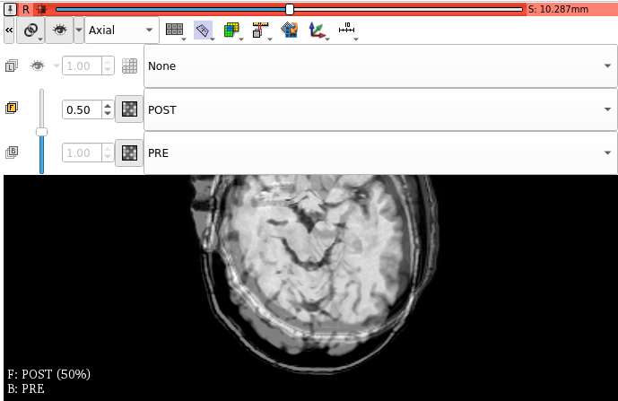
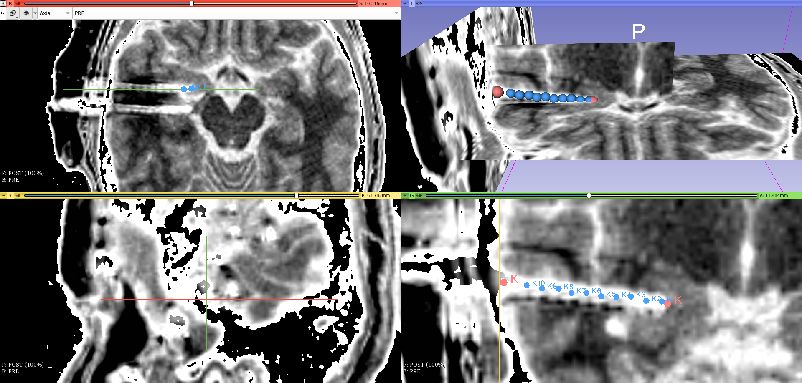

# Localize sEEG contacts

## Prerequisite before starting

### Freesurfer segmentation

The Fressurfer segmentation have to be launched **before** localizing your sEEG contacts. Checkout the [segmentation guide](https://github.com/brainets/ressources/blob/master/segmentation/segmentation.md)

### Get the number of contacts per electrodes in the data (optional)

In the seegpy python toolbox, there's a function called `seegpy.contacts.analyse_channels_in_trc` that can be used to read the channel names such as the number of contactcs in your TRC file. This can then be convenient to get the number of contacts that are required per electrodes.

```python
from seegpy.contacts import analyse_channels_in_trc

trc_path = '/path/my_file.TRC'
report_path = '/path_for_saving/channel_report.txt'

analyse_channels_in_trc(trc_path, print_report=report_path)
```

All of the informations about the contacts are going to be written inside a text file.

## Step 1 : Align the post and pre implantation images

### Load the post-implantation and pre-implantation Fresurfer MRI

* Open Slicer
* Go to `File/Add data/Choose File(s) to add` and pick your MRI pre and post implantation (or CT). **For the MRI pre, choose the MRI processed by Freesurfer (i.e `subject_folder/mri/T1.mgz`)**. Press `show options` and in the options of you file you should be able to rename your post `POST` and the T1.mgz as `PRE`
* You should now see the coronal / sagittal / axial 2D views. Click on the little pin top left of one view and set it like the figure below :



### Align the post on the pre

* The post and pre are misaligned so we are going to apply a transformation to the post to bring it in the pre space (Freesurfer scanner based). To do that :
    * In the modules, search for `Automated Expert Registration`
    * In the `IO` section :
        * Set the `Fixed image` to `PRE`
        * Set the `Moving image` to `POST`
    * In the `Registration Parameters` section :
        * Set the `Load transform` to `Create a new transform as` and name it `tr_post_to_pre_fs_scanner`
        * Set `Initialization` checkbox to `None`
        * Set `Registration` checkbox to `Affine`
        * Press `Apply`
* Once compute, open the `Data` module then go to `Transform Hierarchy` and drag and drop the `POST` file on the `tr_post_to_pre_fs_scanner`. The transformation is applied to the MRI-post and both pre and post should be aligned


### Improve contrast of the post image

* Click again on a pin to change the transparency so that the post is completely ovelarping the pre
* Open the `Volume` module
* In the `Active Volume` list, pick the `POST`
* Change the colormap for `InvertedGrey`
* Change the threshold to improve the contrast (you can also click on one image and scroll)


## Step 2 : define entry point and tip of the electrode

### Define your markups for the entry point and tip of each electrode

* Open the `Markups` module
* On the `List`, choose `Create new MarkupsFiducial as...` and name it `reference`
* Activate `Click to Jump Slices` and activate `Show slice intersections`. Once activated, deactive `Click to Jump Slices`
* If you keep the `SHIFT` keyboard key and if you move the mouse over one view, the center of the cross should follow the mouse position. To add a markup :
    * Move the center of the cross to the very end of the electrode
    * In the top toolbar you should found a symbol with a red circle with a blue arrow. Click on it. Once activated, each time you're going to left click on a view it's going to insert a markup
    * Press in the center of the cross to insert a markup
    * Once the markup inserted, go to the table and change the name of the contact with the name of you electrode (e.g 'K')
    * Insert a second markup for the entry point of the electrode in the cortex. In the table, give the same name as the tip ('K')

This two markups define the entry point and the end of the electrode K. Repeat this process for each electrode


### Interpolate contacts between entry point and tip

* Open the `SEEGA/Contact Position Estimator module`
* In the `Configuration` section :
    * click on the three points and navigate to the `SEEGA/ContactPositionEstimator/DeetoS` folder (i.e the folder you cloned during the [first step](https://github.com/brainets/ressources/blob/master/seeg/1_install_dependencies.md))
    * Pick the file according to your OS (windows / linux / mac). For linux users, choose `deeto-static-linux64`
* In the `Segmentation` section :
    * In the `Fiducial list`, pick the `reference` list. You should see the name of all the electrodes
    * Activate the checkboxes `TP` and `cEP`
    * Select the `Type/Model` of your electrode according to your number of contacts
    * For the `CT Volume` choose `POST`

You should see green circles for the interpolated contacts. To check the results :
* Open the `Markups` module
* In the `List` you should now have a `recon` entry
* The table should contains all the interpolated sites

**IMPORTANT :** you can drag-and-drop each contact directly from each of the 2D views. This can improve the result of the automatic interpolation




## Save your session

* Once everything finished, I strongly recommend to save the full 3D slicer session so that you can come back later and reload it. To do it, simply :
    * Click on `File/Save`
    * Check all boxes and choose a folder where saving everything

**Note :** markups are saved in \*.fcsv. Seegpy provide a function for reading the coordinates : `seegpy.io.read_3dslicer_fiducial`

```python
from seegpy.io import read_3dslicer_fiducial

fcsv_path = '/path/recon.fcsv'
xyz = read_3dslicer_fiducial(fcsv_path)
```

Now you can go to the section for [labelling contacts](https://github.com/brainets/ressources/blob/master/seeg/3_labelling_contacts.md) according to the Freesurfer (and MarsAtlas) segmentations
