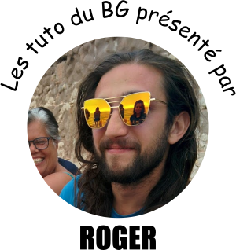

# MarsAtlas Documentation

You can look at [this tutorial](https://www.dropbox.com/s/ggqq2tkil2bvq4m/BrainVisaTraining-corticalSurface-2017.pdf?dl=0) from Olivier Coulon (it is not identical)

## Step 1. Import MRI data and apply spatial filter

This step is required for cleaning the MRI data and reducing noise
* Open SPM12
* Open toolbox VBM8
* Choose 'extended tools' then `Spatially adaptive non local means denoising filter`. Select the MRI files and run the filter (green triangle). It will save the files in the same folder with a different name

## Step 2. Check correct MRI orientation

* Type `cd /hpc/soft/brainvisa/brainvisa_4.5.0` press enter and run `./anatomist`
* Drag and drop it in one of the features on the left side. If the slices are not correctly oriented (they do not correspond to axial, coronal and sagittal view), re-orient them in spm.
* To correct orientation, in spm-fmri, click on display to open mri and change the radiants to change the reference matrix (e.g., put pi/2 or -pi/2 in some of them to find the correct orientation: nose on the left for sagittal) then I press reorient. Then save the matrix with the info created. Apply the spatial filter in spm again and afterwards you should see the images correctly on anatomist
* Another way to reorient the slices is to run morphologist 2015 running only the first two steps

## Step 3. Create Brainvisa databases (only once at the beginning)

### Create empty useful folders
* At first create your own folder on `/hpc/group`, and call it `surname.n`
* Create the folder `databases` in `/hpc/group/surname.n` directory
* Create other three folder, `db_brainvisa`, `db_freesurfer` and `db_mri` in `/hpc/group/surname.n/databases` directory
* In the `db_mri` folder you will store the data that you have to analyze, dividing them from a study to another. So you have to create a folder that will contain all the data of the subjects of your study, we will call this folder `meg_te`.
* It is convenient to call all subject folders, and the files stored in them, as “subject_01”, “subject_02”...
* As soon as you decide the name for the study folder (i.e. `meg_te`), use the same name to create a folder in: `/hpc/group/surname.n/databases/db_freesurfer` this will be essential to create databases with right coordinates

### Opening and setting BrainVISA 4.5 in frioul
* Open the Shell and from `surname.n@frioul` type: `frioul_interactive`
* Once you are in a node, you can open BrainVISA just typing: `BrainVISA` (pay attention to respect upper- and lower-case)
* Alternatively from a node you can open the BrainVISA directory typing: `cd /hpc/soft/brainvisa/brainvisa_4.5.0`
* After that, press enter and then type: `./BrainVISA`
* Once you opened BrainVISA go to: `BrainVISA-> Preferences-> BrainVISA` and set: `userLevel-> Expert`; and: `textEditor-> /usr/bin/gedit`

### Creating databases in BrainVISA
* In BrainVISA, go to: `BrainVISA-> Preferences-> Databases`
* In Databases, press `Add` and select the previously created directory `/hpc/group/surname.n/databases/db_brainvisa` expand the `expert_settings` and set `ontology->brainvisa-3.2.0`
* In Databases, press Add and select the previously created directory `/hpc/group/surname.n/databases/db_freesurfer/meg_te` expand the `expert_settings` and set `ontology-> freesurfer`.
* Press Ok to save, it will open a window to update databases in BrainVISA. Check only the two databases you’ve just created and the `full update` option, then click on `Update`. If this window doesn’t appear automatically, you have to open it manually: in BrainVISA go to: `Data Management-> Update databases` (double click)

## Step 4. Import subject’s MRI into Brainvisa

* In BrainVISA, go to: `Morphologist-> import (expand)-> Import T1 MRI` (double click)
    * Select input data of a subject file from the directory: `/hpc/group/surname.n/databases/db_mri/meg_te/subject_01` (the name of the file would be `subject_01.nii`), then click `Open`
    * The output and the referential boxes will be filled automatically, but you have to change both the destination paths. Change the input from: `/hpc/group/surname.n/databases/db_brainvisa/subjects/subject_01/...` to: `/hpc/group/surname.n/databases/db_brainvisa/meg_te/subject_01/...` and do the same changing for the referential.
* Update again the databases, in BrainVISA go to: `Data Management-> Update databases` (double click)
* If run iterate, check that the destination paths and subjects are correct in the database

## Step 5. Run Freesurfer

### Setting fast access to freesurfer
* Create a new file in your own folder (`/surname.n`) and rename it as [freesurfer_pipeline.sh](https://github.com/brainets/ressources/segmentation/freesurfer_pipeline.sh)
* Open it with gedit, then copy and paste the lines that you can find at the and of this pipeline, just like they are
* Change for your task name (`TASK`) and check that this is where the data are located (`TEAM_DIR`)
* Right click on this file: `Properties-> Permission-> Execute` checkmark on `Allow executing file as program`. Alternatively, from a linux terminal you can enter `chmod +x freesurfer_pipeline.sh`

### Execution of freesurfer on a subject
* Open the Shell and from `surname.n@frioul` type: `frioul_interactive`
* Type: `cd /hpc/group/surname.n`
* Type: `freesurfer_setup`
* Type: `./freesurfer_pipeline.sh subject_01`. Wait about 12h... doing something else... read articles
* Update BrainVISA database. Go to: `Data Management-> Update databases` (double click)-> Update

## Step 6. Import results from Freesurfer to BrainVISA 

* In BrainVISA go to: `Freesurfer-> Tools-> Freesurfer output to BrainVisa conversion pipeline`
    * Click the database symbol near the “anat” field, then select `/hpc/group/surname.n/databases/db_freesurfer/meg_te` in the `Database` field
    * On your right, select the subject file on which you want to perform the conversion and click Ok and then `Run` (as you can see the other fields are automatically filled)
* Update databases; in BrainVISA go to: `Data Management-> Update databases-> Update`
* In BrainVISA go to: `Freesurfer-> Import-> Import FreeSurfer gray/white segmentation to Morphologist`
    * Click the database symbol near the “T1_orig” field, and select `/hpc/group/surname.n/databases/db_freesurfer/meg_te`, then choose the subject on the right and click Ok
    * Click the database symbol near the “T1_output” fields,  and fill this fields as follow: 
        * **Database:** /hpc/group/surname.n/databases/db_brainvisa; 
        * **Data type:** Raw T1 MRI; 
        * **File format:** gz compressed NIFTI-1 image; 
        * **subject:** subject_01 (e.g.). 
        * Click `Ok` and `Run`
* Open Morphologist
* Check results and correct import in Morphologist. Don’t run it, just open the file that you want to examine from the bd_database and then click on the eye icons to check if all is correct, especially you can visualize if the `Sulci Recognition` is done.

## Step 7. Create MarsAtlas 

* In BrainVISA go to: `Cortical surface-> anatomy-> HIP HOP cortical parametrization`
    * Choose subject from `db_brainvisa` and `Run`
    * **TROUBLESHOOTING :** How to correct manually the cingular pole if MarsAtlas is not correct:
        * Open cingular pole file on Anatomist by clicking on the green icon in HIPHOP
        * Open the PaintSurf toolbox: the icon is the color palette
        * Get the color from the cortex using the syringe
        * Draw the contour using the free (unconstrained) or sulci based contour: the icon is the brain with a colored line
        * Select all points that are outside the correct cingular mask using the magic stick
        * Click on the green tick to change color texture of the selected surface
        * Save the file once happy by rewriting old file name \*\_pole_cingular.gii
        * Use `Cortical Surface -> Anatomy -> Tools -> Cingular Pole From Manual` to correctly transform the texture. Select the subject and `Run`
        * Rerun HIPHOP without the first two steps
* In BrainVISA go to: `Cortical surface-> low-level-> 2D parcellation to 3D parcellation`
    * Choose the `db_brainvisa`, the subject and then, on the right, the `left hemisphere marsAtlas parcellation texture`
* In BrainVISA go to: `Cortical surface -> anatomy -> tools -> Subcortical From Freesurfer to MarsAtlas Parcellation`
    * Manually change the path within the freesurfer_database area, writing the right  directory: `/hpc/group/surname.n/databases/db_freesurfer/meg_te`
    * If an error occurs, quit BrainVISA and  try these three different solutions: 
        * Go to the terminal and type `freesurfer_setup`, then open BrainVISA in the same terminal and try again
        * Go to the terminal and type: `export BASH=/hpc/soft/freesurfer/freesurfer_5.3.0/bin/:$BASH`, then open BrainVISA in the same terminal and try again
        * Go to the terminal and type: `export PATH=$PATH:/hpc/soft/freesurfer/freesurfer/bin`, then open BrainVISA in the same terminal and try again
* Create decimated surfaces 
    * Place the directory with the directory containing the 138 MarsAtlas parcellation somewhere such as:
        * `/hpc/comco/basanisi.r/Databases/db_brainvisa/hiphop138-multiscale`.
        * This directory can be downloaded [here](https://cloud.int.univ-amu.fr/index.php/s/4kGER6oest86oy3)
        * This directory contains all the decimated surfaces
    * `Cortical surface -> anatomy -> tools -> spherical_mesh_from_HIPHOP_parameterization`
    * `Cortical surface -> anatomy ->group -> Remesh_From_Sphere`
        * Here you need to specify the spherical template the you want to use with the desired resolution.
        * Example of file for the "spherical template” (*/hpc/comco/brovelli.a/Code/Brainvisa/hiphop138-multiscale/Decimated/4K/hiphop138_Lwhite_dec_4K_spherical.gii*)
    * Redo it for the other hemisphere
