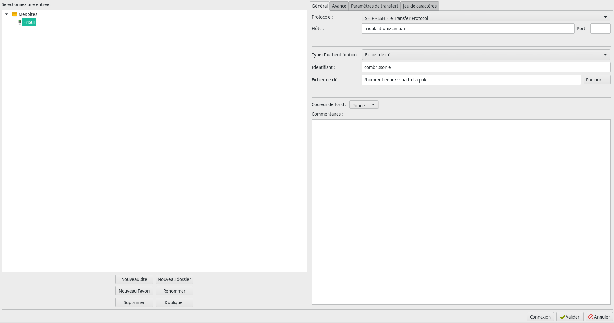

# Transfer data using FileZilla

FileZilla offers a graphical user interface for transferring your data in a very convenient way. Start by [downloading FileZilla](https://filezilla-project.org/) according to your system.

## Add a connection to a server

* Click on `Fichier / Gestionnaire de Sies...`
* Press the button `Nouveau Site` and name it for example `Frioul`
* Configure as follow for frioul :
    * `Protocole` = `SFTP - SSH File Transfer Protocole`
    * `Host` = `frioul.int.univ-amu.fr`
    * `Port` = leave it empty
    * `Type d'authentification` = `Fichier de clés`
    * `Identifiant` = `lebeaugosse.r`
    * `Fichier de clés` = navigate to the ssh key file that you're using in order to connect to Frioul

FileZilla requires either a ssh key file with the extension `*.pem` or `*.ppk`. Usually we have a ssh key file with the extension `id_rsa.pub` and therefore it should be converted :
* **PUB -> PEM** : open a text editor, copy-past the content of the `pub` file. Then save it as `id_rsa.pem`. Then you can try to load it using FileZilla (it's probably going to say that FileZilla is going to convert the file for you)
* **PUB -> PPK** : this can be done using [PuTTYgen](https://docs.acquia.com/acquia-cloud/manage/ssh/sftp-key/)

Finally, click on `validate` or `connect`

