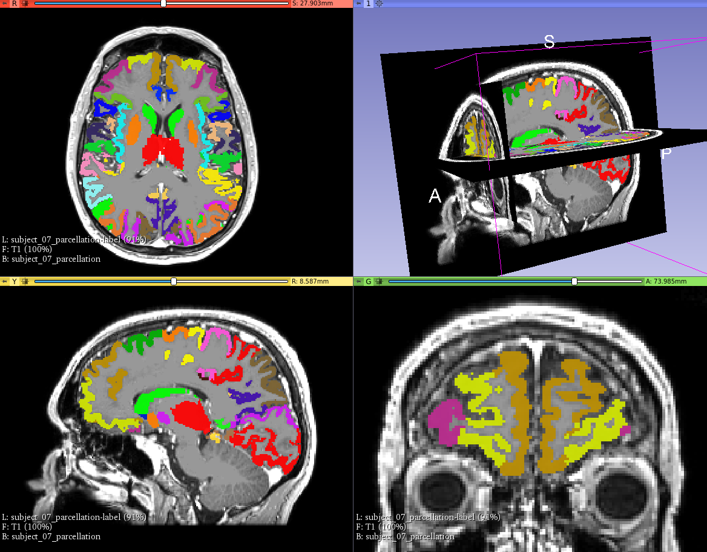

# Volume

## Color and labelize a mesh according to MarsAtlas

### Add the MarsAtlas color table

1. Download the [MarsAtlas.ctbl](https://github.com/brainets/ressources/tree/master/slicer/data/MarsAtlas.ctbl) file.
2. Copy the file inside the `slicer` directory : `slicer/share/Slicer-4.10/ColorFiles/MarsAtlas.ctbl`
3. Close and reopen slicer. If you go to the `Colors` module you should find the `MarsAtlas` color

### Labelize the volume with MarsAtlas

1. Import your volume
2. Select the `Editor` module
3. Select the `MarsAtlas` colormap
4. Switch to the `Volume` module
5. In the `Volume Information` section, in the `Convert to label map` dropdown list, select the label defined above
6. Click on `Convert`

Colors should now be updated.

**TRICK :** if you see weird edges, go to `Volume > Display` and uncheck the box `Interpolate`

## Extract mesh from volume

1. Import the volume
2. Go to `Segment Editor`
3. You can create a new segmentation : `Segmentation > Create new segmentation as...`
4. Select the volume to use for the segmentation `Master volume`
5. Click on `+ Add`
6. Rename it according to the ROI number (e.g OFCvm=38). You can also change the color
7. Select the `Threshold` in the `Effect` section below
8. Set manually the boundaries. For example, if you want to extract the ROI 38 you can set the min to `38.1` and the max to `38.9`. The only important thing is that min and max are starting with `38.`
9. Click on `Apply`
10. If the mesh is not showing click on `Show 3D`. You can also set the smoothing factor

You can then add multiple ROI mesh using the `+ Add` button. Once you added all of the ROI, you can click on `-> Segmentations`. By clickong on it, you switch to the `Segmentation` module. From it, you have a fine control over the generated mesh (transparency, hide / display etc.)

## Recenter, transform, crop and export a volume

### Recenter

Recenter a volume can be interesting for the following other operations (e.g rotation and crop)
* Open the `Volume` module
* Select your volume in `Active volume`
* Now, in `Volume information` press `Center volume`

### Transform

This operation can be used to rotate and translate your volume using a transformation and then apply your transformation.
* Open the `Transforms` module
* Create a new transformation in `Active Transform`
* In `Apply transforms` select your volume in the list and press the green arrow. The volume should now be in the `Transformed` column
* Use the rotation and translation sliders to fine tune your transformation

One you're fine with the transformation, you might want to harden the transformation (i.e use this transformation as the default one for the volume). In that case :
* Go to the `Data` module
* Switch to the `Transform Hierarchy` tab
* Find your transformation name and then unfold it
* Right click on the volume name and select `Harden transform`

### Crop

For cropping a volume, it's usually easier it has been already recentered and transformed. Then :
* Open the `Crop Volume`
* In the `IO` section, select your volume in the `Input volume` list
* In the `Output volume` choose either if you want to perform the cropping inplace (i.e select your volume) or if you want to create a new volume
* In the `Input ROI`, select `create new AnnotationROI as...` and name it
* Now you should see boundaries in the axial, coronal and sagital views. Drag and move your boundaries.
* Once finished, click on `Apply`

### Export

Exporting your volume is straightforward :
* Click on the `File / Save`
* Uncheck everything and click the checkbox of the volume to export
* You can modify the file name such as the extension (nii, mgz etc.)
